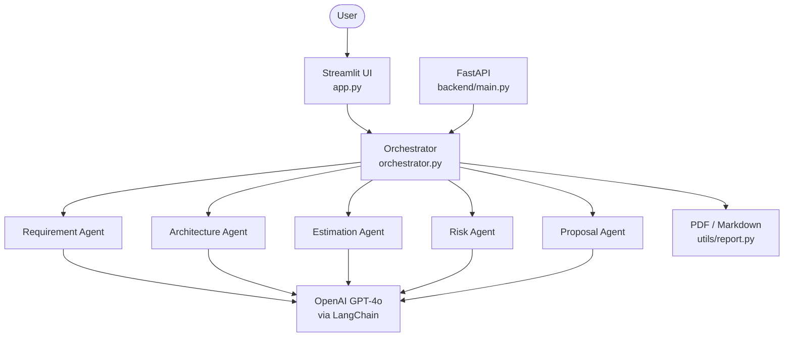

# 🧩 AI Solution Architect Agent

Turn a client **requirement document** into a complete **solution blueprint** —
architecture, tech stack, effort estimate, risk register, and a proposal-ready
summary — in minutes.

Built for consulting **presales teams, solution architects, delivery managers,
and technical consultants** to slash the time spent on solution design.

> Upload a requirement → 5 specialised agents run → download a client-ready report.

---

## ✨ What it does

A lightweight, sequential workflow where each step behaves like a focused agent:

| # | Agent | Output |
|---|-------|--------|
| 1 | **Requirement Analysis** | Project name, business goal, users, features, integrations, constraints |
| 2 | **Architecture** | Recommended architecture, tech stack & a **Mermaid diagram** |
| 3 | **Effort Estimation** | Phase-by-phase person-days, total, and team structure |
| 4 | **Risk Analysis** | Risk register with impact, likelihood & mitigations |
| 5 | **Proposal** | Executive summary, solution, timeline, assumptions, next steps |

Everything is assembled into one `SolutionBlueprint` and rendered in a clean
single-page UI, with one-click **PDF** and **Markdown** download.

---

## 🚀 Quick start

```bash
# 1. (optional) create a virtual environment
python -m venv .venv
# Windows:
.venv\Scripts\activate
# macOS / Linux:
source .venv/bin/activate

# 2. install dependencies
pip install -r requirements.txt

# 3. (optional) add your OpenAI key for live GPT-4o output
copy .env.example .env      # Windows   (or: cp .env.example .env)
# then edit .env and set OPENAI_API_KEY=sk-...

# 4. run the app
streamlit run app.py
```

The app opens at **http://localhost:8501**.

> **No API key? No problem.** Without `OPENAI_API_KEY` the app runs in
> **demo mode** and produces realistic sample output — ideal for an offline
> workshop. Add a key any time to switch to live GPT-4o generation.

### Try it in 30 seconds
1. Click **“Load sample requirement”** (an AI HR Assistant brief).
2. Click **“Generate Solution Blueprint.”**
3. Scroll through the results and **download the PDF**.

---

## ☁️ Deploy to Streamlit Community Cloud (free, permanent link)

1. **Push this folder to a GitHub repo** (see commands below).
2. Go to **[share.streamlit.io](https://share.streamlit.io)** → **New app** → pick your
   repo, branch `main`, and set **Main file path** to `app.py`.
3. Click **Advanced settings → Secrets** and paste your key (this replaces `.env`):
   ```toml
   OPENAI_API_KEY = "sk-your-key-here"
   OPENAI_MODEL = "gpt-4o"
   OPENAI_TEMPERATURE = "0.2"
   ```
4. Click **Deploy**. You get a permanent URL like
   `https://<your-app>.streamlit.app` that auto-redeploys on every `git push`.

> The app reads the key from `st.secrets` on the cloud and from `.env` locally —
> both work, and neither secret is ever committed to GitHub.

### Push to GitHub
```bash
cd AI_Architect_Solution
git init
git add .
git commit -m "AI Solution Architect Agent"
git branch -M main
git remote add origin https://github.com/<your-username>/<your-repo>.git
git push -u origin main
```

---

## 🖥️ Optional REST backend (FastAPI)

The Streamlit UI is fully self-contained, but a REST API is included so the
pipeline can be consumed by other clients.

```bash
python run.py api          # or: uvicorn backend.main:app --reload --port 8000
```

| Method | Endpoint | Description |
|--------|----------|-------------|
| `GET`  | `/health` | Service status & mode (llm / demo) |
| `POST` | `/analyze` | `{"document": "..."}` → full blueprint JSON |
| `POST` | `/analyze/upload` | Upload a PDF/TXT/MD file → blueprint JSON |
| `POST` | `/report/pdf` | Blueprint JSON → downloadable PDF |

Interactive docs at **http://localhost:8000/docs**.

---

## 🏗️ Architecture



Each agent calls GPT-4o through LangChain and falls back to a built-in
heuristic generator when no key is configured.

---

## 📁 Project structure

```
AI_Architect_Solution/
├── app.py                     # Streamlit single-page UI
├── orchestrator.py            # Runs the 5-agent pipeline, builds the blueprint
├── run.py                     # Convenience launcher (ui / api)
├── agents/
│   ├── base.py                # Shared LLM client + JSON parsing + demo mode
│   ├── requirement_agent.py   # Step 1
│   ├── architecture_agent.py  # Step 2
│   ├── estimation_agent.py    # Step 3
│   ├── risk_agent.py          # Step 4
│   └── proposal_agent.py      # Step 5
├── prompts/                   # One prompt template per agent
├── utils/
│   ├── schemas.py             # Pydantic models (typed contract)
│   ├── pdf_utils.py           # PyPDF text extraction
│   ├── mermaid.py             # Mermaid diagram generator
│   └── report.py              # PDF (fpdf2) + Markdown export
├── backend/
│   └── main.py                # Optional FastAPI REST API
├── sample/
│   └── sample_requirement.md  # Demo requirement document
├── reports/                   # Generated reports (gitignored)
├── uploads/                   # Uploaded documents (gitignored)
├── requirements.txt
├── .env.example
└── README.md
```

---

## 🛠️ Tech stack

| Layer | Technology |
|-------|------------|
| Frontend | **Streamlit** |
| Backend | **Python · FastAPI** |
| AI framework | **LangChain** |
| LLM | **OpenAI GPT-4o** |
| PDF in | **PyPDF** |
| PDF out | **fpdf2** |
| Data models | **Pydantic** |

No authentication, no Docker, no Kubernetes, no cloud setup required — built to
be **simple to run, easy to explain, and demo-friendly.**

---

## 🎤 Workshop demo flow

1. User uploads (or pastes) a requirement document.
2. The system extracts the text (PyPDF for PDFs).
3. The 5 agents run in sequence with a live progress bar.
4. All outputs render on a single page, including the architecture diagram.
5. The user downloads a polished PDF / Markdown report.

---

## 🔧 Configuration (`.env`)

| Variable | Default | Purpose |
|----------|---------|---------|
| `OPENAI_API_KEY` | _(empty → demo mode)_ | Your OpenAI key |
| `OPENAI_MODEL` | `gpt-4o` | Model used by every agent |
| `OPENAI_TEMPERATURE` | `0.2` | Sampling temperature |
| `BACKEND_URL` | `http://localhost:8000` | FastAPI URL (if used) |

---

## ❓ Troubleshooting

- **Diagram not showing?** It renders from a CDN — ensure you have internet, or
  read the Mermaid source from the “View Mermaid source” expander.
- **Still in demo mode with a key set?** Make sure the `.env` file sits next to
  `app.py` and the key doesn’t start with `your`.
- **PDF export error on exotic characters?** Text is sanitised to latin-1
  automatically; unusual glyphs are replaced rather than crashing the export.
